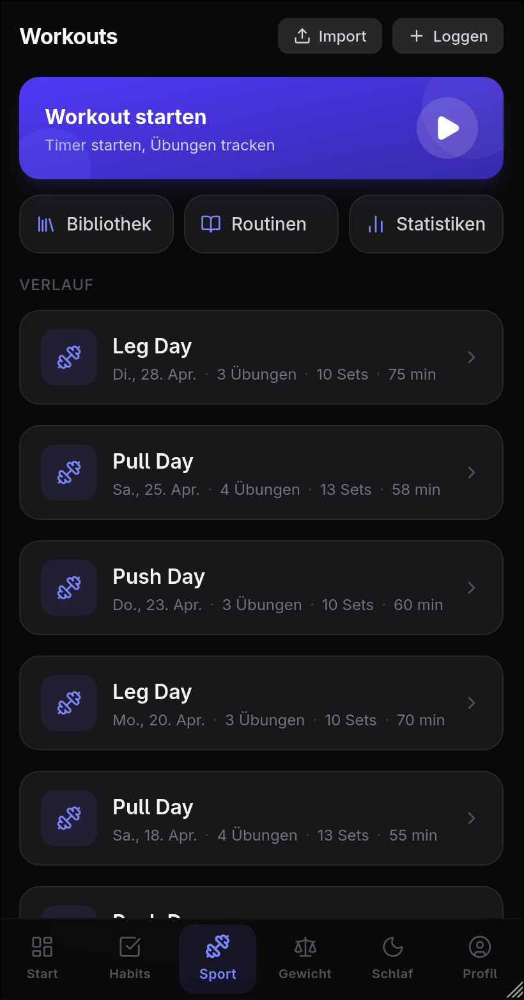
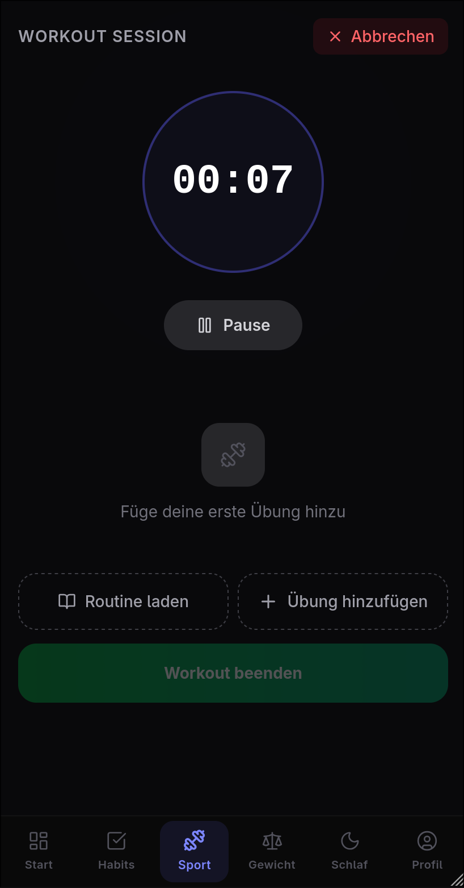
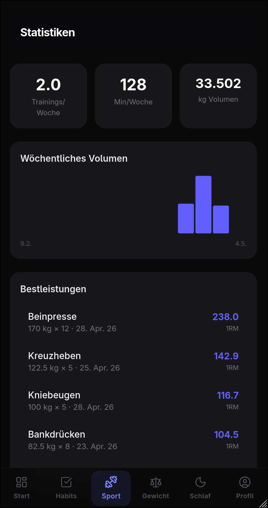

# 生 Jinsei

Personal life-tracking app — workouts, nutrition, habits, sleep and weight in one place. Built as a mobile-first PWA.

## Features

- **Workouts** — log sessions manually or import directly from Hevy (paste share text)
- **Exercises** — custom exercise library with muscle group tagging and per-exercise rest timer
- **Routines** — reusable workout templates for quick session starts
- **Habits** — daily habit tracking with streaks
- **Nutrition** — meal logging via OpenFoodFacts barcode/search
- **Sleep & Weight** — daily logging with trend charts
- **Analytics** — volume, frequency and progress charts per muscle group

## Screenshots

| Workouts | Session | Analytics |
|----------|---------|-----------|
|  |  |  |

> Add screenshots to `docs/screenshots/` to populate the table above.

## Stack

| Layer | Tech |
|-------|------|
| Frontend | React 19 + TypeScript + Vite + Tailwind CSS |
| Backend | ASP.NET Core 10 (minimal hosting, controllers) |
| Database | PostgreSQL via Entity Framework Core |
| Auth | ASP.NET Core Identity + cookie auth |
| PWA | vite-plugin-pwa (Workbox) |
| Container | Docker Compose (dev + prod) |

## Dev Setup

**Prerequisites:** Docker, .NET 10 SDK, Node 20+

```bash
./dev.sh
```

Starts Postgres (port 5431), backend (`http://localhost:5132`) and frontend (`http://localhost:5173`) together. Ctrl+C tears everything down.

### Individual components

```bash
# Backend only
cd backend && dotnet watch run

# Frontend only
cd frontend && npm run dev

# Postgres only
docker compose -f docker/docker-compose.dev.yml up -d
```

### Frontend tooling

```bash
cd frontend
npm run build   # tsc + vite build
npm run lint    # ESLint
```

## Import from Hevy

On the Workouts page, tap **Import** and paste the share text from Hevy:

```
Push
Donnerstag, Apr 30, 2026 um 5:54pm

Bankdrücken
Set 1: 80 kg x 8
Set 2: 75 kg x 9
```

Exercises are matched by name (case-insensitive) or created automatically if not found.

## Production

```bash
cp .env.example .env
# fill in POSTGRES_USER, POSTGRES_PASSWORD, POSTGRES_DB

docker compose -f docker/docker-compose.yml up -d
```

Frontend nginx serves on 80/443 and reverse-proxies `/api/` to the backend container.

## Project structure

```
backend/          ASP.NET Core Web API
  Controllers/    REST endpoints
  Data/
    Entities/     EF Core models
    Migrations/   DB migrations
frontend/
  src/
    features/     API clients + React Query hooks
    pages/        Route-level components
    components/   Shared UI
docker/
  docker-compose.dev.yml   Postgres only (dev)
  docker-compose.yml       Full prod stack
```
